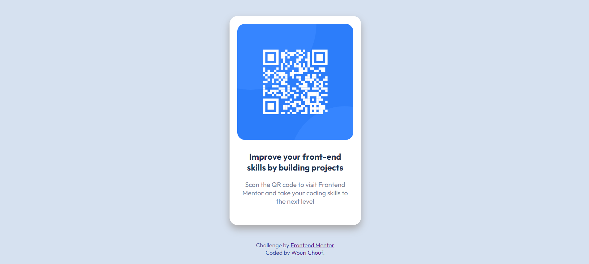

# Frontend Mentor - QR code component solution

This is a solution to the [QR code component challenge on Frontend Mentor](https://www.frontendmentor.io/challenges/qr-code-component-iux_sIO_H). Frontend Mentor challenges help you improve your coding skills by building realistic projects.

## Table of contents

- [Frontend Mentor - QR code component solution](#frontend-mentor---qr-code-component-solution)
  - [Table of contents](#table-of-contents)
  - [Overview](#overview)
    - [Screenshot](#screenshot)
      - [Desktop preview](#desktop-preview)
      - [Mobile preview](#mobile-preview)
    - [Links](#links)
  - [My process](#my-process)
    - [Built with](#built-with)
  - [Author](#author)

## Overview

### Screenshot

#### Desktop preview

#### Mobile preview

### Links

- Solution URL: [GitHub repos](https://github.com/Richouf95/QR_Component)
- Live Site URL: [Live site]([https://your-live-site-url.com](https://qr-component-ochre.vercel.app/))

## My process

### Built with

- [React](https://reactjs.org/) - JS library
- Semantic HTML5 markup
- CSS3
- JSX
- Flexbox
- Mobile-first workflow

## Author

- Linkedin - [@wourichouf](https://www.linkedin.com/in/wourichouf)
- Frontend Mentor - [@Richouf](https://www.frontendmentor.io/profile/Richouf95)
- Twitter - [@wourichouf](https://twitter.com/wourichouf)
